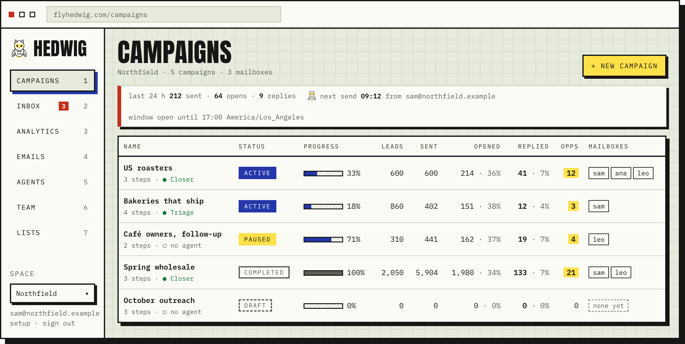
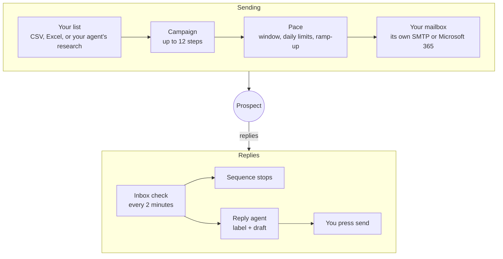
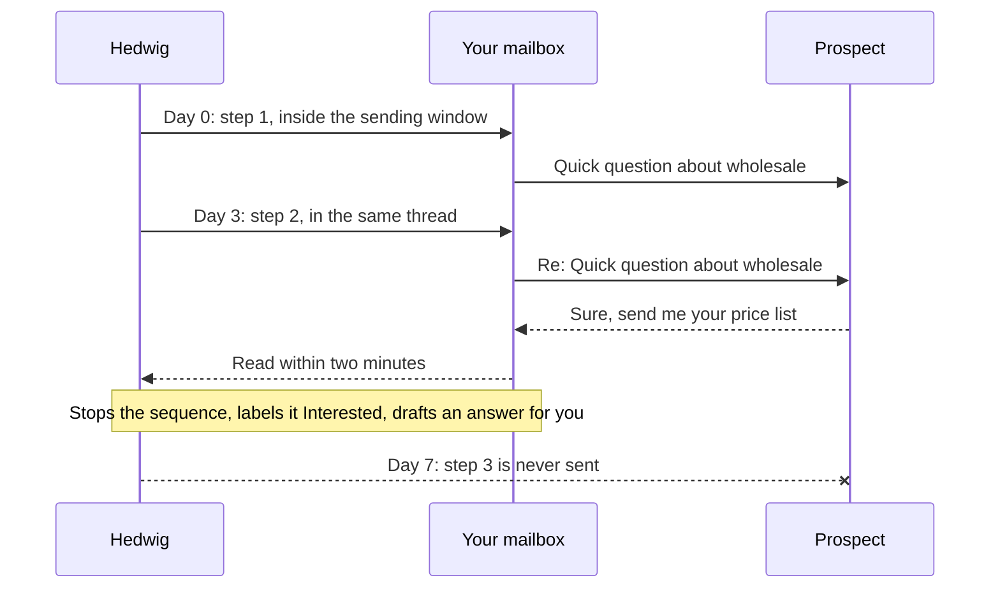
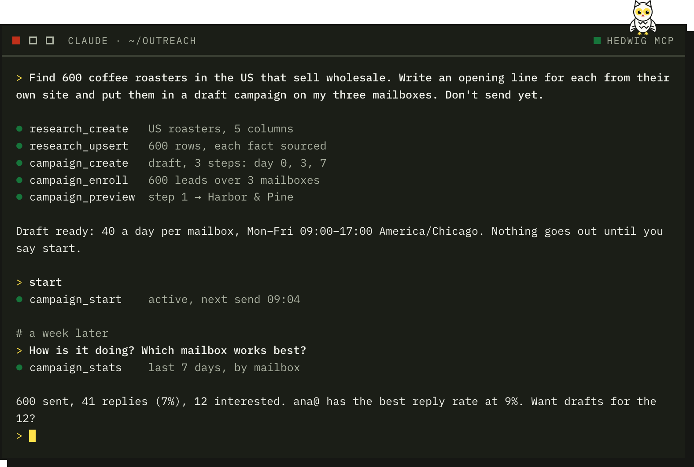

<p align="center">
  
</p>

<h1 align="center">Hedwig</h1>

<p align="center">
  <b>Your B2B email campaigns, free and simplified.</b><br>
  Email sequences from the mailboxes you already own. You can control Hedwig and analyze your campaigns from Claude Code or Codex.
</p>

<p align="center">
  <a href="https://flyhedwig.com"><b>flyhedwig.com</b></a> ·
  <a href="#start">Start</a> ·
  <a href="docs/self-hosting.md">Self-host</a> ·
  <a href="docs/mcp.md">Agent setup</a>
</p>

<p align="center">
  <a href="LICENSE"></a>
  
  
  
</p>

<picture>
  <source media="(prefers-color-scheme: dark)" srcset="docs/assets/campaigns-dark.png">
  
</picture>

## The idea

A sequence is simple: a first email, a few follow-ups, and a stop the moment someone answers. What makes it work is
where it is sent from and how carefully. Hedwig handles both, and lets your agent do the rest.

- **Your mailbox sends it.** Hedwig connects to the mailboxes you already have and sends through them, the way you would
  by hand. No shared sending servers, no borrowed reputation.
- **Hedwig keeps a human pace.** A few dozen emails a day per mailbox, spread over working hours in the timezone you pick.
  New mailboxes start slow and speed up week by week.
- **Replies come back to you.** Every inbox is read every two minutes. Whoever answers leaves the sequence, and their reply
  arrives labelled: interested, meeting, question, not interested.
- **Your agent does the busywork.** Claude Code or Codex can build the list, write the openers, launch the campaign and
  tell you what is working.

## How a campaign runs



## One lead, start to finish



## Control and analyze it from your terminal

<picture>
  <source media="(prefers-color-scheme: dark)" srcset="docs/assets/terminal-dark.png">
  
</picture>

Connect once:

```bash
# Claude Code: then type /mcp in a session to sign in
claude mcp add --transport http hedwig https://flyhedwig.com/mcp

# Codex
codex mcp add hedwig --url https://flyhedwig.com/mcp
codex mcp login hedwig
```

Running your own server? Use its address instead of flyhedwig.com. Then ask in plain words:

> How is the roasters campaign doing? Which mailbox and which step get the most replies?

> Who replied interested this week? Draft answers, I'll send them.

> Pause the campaign, add these 200 contacts and show me step 2 for the first one.

<details>
<summary><b>Everything the agent can reach</b></summary>

| Area | What it can do |
| --- | --- |
| Campaigns | Create, edit, preview, test-send, start, pause, clone, statistics |
| Leads | Enroll, enrich, correct, requeue, remove |
| Research | Tables where each fact keeps its source |
| Inbox | Read threads, label, draft, send the replies you ask for |
| Mailboxes | Daily limit, timezone, ramp-up, DNS check |
| Workspace | Members, invitations, reply agents |

Starting a campaign and sending a reply are separate permissions you grant when you connect. Mailbox passwords never pass
through the agent. More in [docs/mcp.md](docs/mcp.md).

</details>

## Ideas

- Write to 200 agencies from three mailboxes, a few dozen a day each, so none of them gets flagged.
- Follow up with everyone you met at a trade show, during their working hours, in their timezone.
- Let your agent research the list and write the openers; keep the send button for yourself.
- Hand a teammate the Inbox: replies arrive labelled, with a draft waiting.

## Start

**Hosted.** Sign up at [flyhedwig.com](https://flyhedwig.com).

**On your own server.** You need Docker.

```bash
git clone https://github.com/gabrilator/hedwig && cd hedwig
cp .env.example .env          # set ORIGIN, HEDWIG_MASTER_KEY and the first user
docker compose up -d --build
```

Open the address you set as `ORIGIN` and sign in. Every setting, and Microsoft 365, is in
[docs/self-hosting.md](docs/self-hosting.md).

**Then, either way:**

1. **Emails**: connect a mailbox with its address and password (Microsoft 365 uses Microsoft's own sign-in).
2. **Campaigns**: create one and import your list under **Leads**.
3. **Sequence**: write the steps, with `{{firstName|there}}` style variables.
4. **Schedule** and **Options**: set the sending window, pick the mailboxes, then press **Activate**.

## Good to know

- Every email leaves through your own mailbox: its SMTP server, or Microsoft 365. Hedwig never relays mail.
- Any mailbox with IMAP and SMTP works. Passwords and tokens are encrypted before they are stored.
- An agent labels and drafts. It never sends anything by itself.
- How each part works, and the rules the code keeps: [docs/how-it-works.md](docs/how-it-works.md).

## Contributing

`npm install`, then `npm run dev` and `npm run worker` in two terminals. Run `npm run check` and `npm test` before a pull
request. The rules the code follows are in `CLAUDE.md`, so your coding agent follows them too.

## License

MIT. See [LICENSE](LICENSE).
